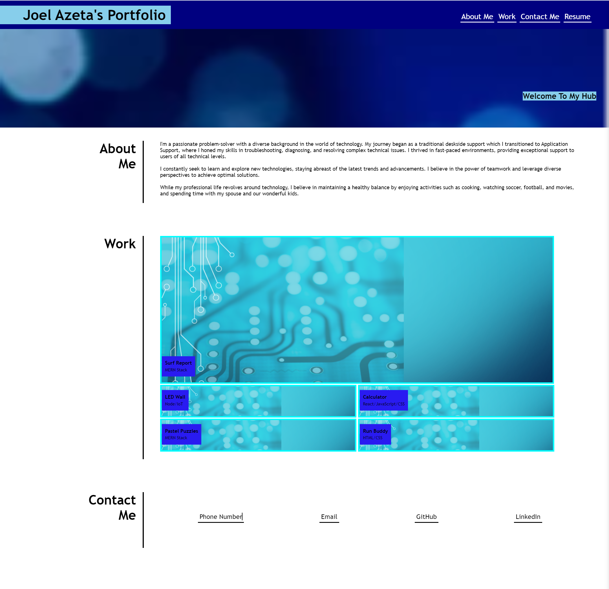

## Advanced-CSS-Challenge
Module 2 Challenge

## Project Name: Professional Portfolio

## Table of Contents
- Description
- Technologies
- Installation & Usage
- Screenshot
- Contact
- Reference
- License

## Description
This is a personal portfolio website showcasing Joel Azeta's professional background, skills, and projects. It features a user-friendly navigation bar, informative sections about About Me, Work, and Contact Me, and a professional footer.

## Technologies
- HTML
- CSS

## Installation & Usage
    1. Clone this repository to your local machine.
        - Github: github.com/ajfizzle/Advanced-CSS-Challenge
        - Github.io: ajfizzle.github.io/Advanced-CSS-Challenge

    2. Open the `index.html` file in your preferred web browser.

    3. Explore the various sections of the portfolio.
## Screenshot

## Contact:
Feel free to reach out to Joel Azeta through the contact information provided on the website or through his social media profiles if you have any questions or feedback.

## Reference:
 - https://www.w3schools.com/howto/howto_css_vertical_line.asp
 - UT Austin Bootcamp - UTA-VIRT-FSF-PT-02-2024-U-LOLC
 - https://html-color.codes/

## License
This code is provided under an open-source license (to be determined). Please refer to the license file for specific terms and conditions.
